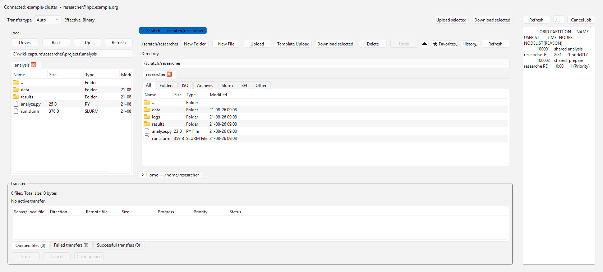

# HPC Client GUI

[](https://github.com/mskomek/hpc-client-gui/actions/workflows/ci.yml)
[](https://github.com/mskomek/hpc-client-gui/releases/latest)
[](pyproject.toml)
[](#downloads)

**A cross-platform desktop client for SSH, SFTP, Slurm job management, remote files, CLI workflows, and optional X11 forwarding on HPC systems.**

Connect to a remote cluster, browse and transfer files, submit and monitor Slurm jobs, inspect job output, use terminal workflows, and launch X11 applications from one client.

**[Download latest release](https://github.com/mskomek/hpc-client-gui/releases/latest)** · **[Documentation](https://github.com/mskomek/hpc-client-gui/wiki)** · **[CLI guide](src/hpc_gui/docs/CLI_GUIDE_en.md)** · **[Report an issue](https://github.com/mskomek/hpc-client-gui/issues)**



---

## Why HPC Client GUI?

Many HPC workflows still require switching between a terminal, an SFTP client, scheduler commands, job-output files, and separate X11 tools.

HPC Client GUI brings those common tasks together in a desktop application without requiring a web portal or additional server-side service on the cluster.

* **Standard SSH + Slurm workflow** - designed for clusters exposing SSH and common Slurm commands.
* **Windows and Linux support** - packaged desktop releases for both platforms.
* **GUI and CLI** - use the desktop interface for daily work and the CLI for repeatable workflows.
* **Remote file management** - browse directories, upload/download files, create folders, rename, delete, and manage transfers.
* **Slurm job control** - submit jobs, inspect queue/accounting state, cancel jobs, and read output files.
* **Optional X11 support** - launch remote graphical applications when required.
* **English and Turkish interface/documentation**.

## Downloads

Current packages are available from the:

### [Latest Release](https://github.com/mskomek/hpc-client-gui/releases/latest)

| Platform               | Release asset                              | Start                                |
| ---------------------- | ------------------------------------------ | ------------------------------------ |
| Windows 10/11 x64      | `hpc-client-gui_windows_onedir.zip`        | Extract and run `hpc-client-gui.exe` |
| Linux x86_64           | `hpc-client-gui-<version>-x86_64.AppImage` | Make executable and run              |
| Debian / Ubuntu x86_64 | `hpc-client-gui_<version>_amd64.deb`       | Install the `.deb` package           |
| Linux / Flatpak        | `hpc-client-gui-<version>-x86_64.flatpak`  | Install and run the Flatpak bundle   |

Where provided, release assets also include **SHA-256 checksum files**. Each
release also publishes a `MANIFEST.json` inventory (size + SHA-256 per asset)
and signed build-provenance attestations — see
[docs/VERIFYING_RELEASES.md](docs/VERIFYING_RELEASES.md).

## Windows quick start

1. Download `hpc-client-gui_windows_onedir.zip` from the [latest release](https://github.com/mskomek/hpc-client-gui/releases/latest).
2. Select **Extract All**.
3. Run `hpc-client-gui.exe`.
4. Enter your cluster host, SSH port, username, and authentication method.
5. Connect and use the Files, Jobs, Outputs, Terminal, or optional X11 tools.

> Do not run the executable directly from inside the ZIP archive.

Python, PuTTY/plink, and VcXsrv are **not required for normal SSH, file-transfer, or Slurm workflows** in the packaged Windows build.

## Linux quick start

Download the AppImage, `.deb`, or Flatpak package from the [latest release](https://github.com/mskomek/hpc-client-gui/releases/latest).

### AppImage

```bash
chmod +x hpc-client-gui-*-x86_64.AppImage
./hpc-client-gui-*-x86_64.AppImage
```

### Flatpak

```bash
flatpak install --user ./hpc-client-gui-*-x86_64.flatpak
flatpak run io.github.mskomek.HpcClientGui
```

---

## Features

### SSH and connection profiles

* SSH host, port, and username configuration
* Password and key-based authentication
* Reusable connection/system profiles
* Optional cluster-specific presets
* Standard SSH-based cluster connectivity

### Remote files and transfers

* Browse local and remote directories
* Upload and download files
* Upload and download directories
* Resumable transfers with pipelined writes and per-file isolated SFTP channels
* Transfer progress and cancellation
* File-conflict handling
* Create remote directories
* Rename files and directories
* Delete files and directories
* Undo for move operations
* Remote navigation history

### Slurm jobs

Submit and manage workloads through standard Slurm commands.

Supported workflows include:

* `sbatch`
* `squeue`
* `sacct`
* `scancel`

The GUI can be used to:

* Submit Slurm scripts
* Monitor running and pending jobs
* Inspect completed-job information
* Cancel jobs
* Read output and error files
* Follow job output

### Plugins

HPC Client GUI has a first-class, declarative plugin ecosystem backed by the
official registry [hpc-client-gui-plugins](https://github.com/mskomek/hpc-client-gui-plugins).
From the built-in Plugin Manager you can install:

* **Cluster profiles** — ready-made site/scheduler definitions (for example
  TRUBA) with paths and command templates.
* **Application lint packs** — conservative static rules such as ANSYS Fluent
  journal checks.
* **Reusable Slurm job templates** — safe, placeholder-based submission
  templates rendered by plain substitution only.

Plugin content is **declarative data**: no executable plugin code is
distributed or run at install time, and installation happens entirely on your
desktop — there is **no server-side cluster installation**. Every file is
verified against SHA-256 hashes recorded in the official registry before a
plugin is activated.

### Terminal and editor

HPC Client GUI includes desktop terminal and editor workflows for common remote tasks.

This makes it possible to use file management, job management, terminal commands, and remote editing from the same application.

### CLI

The project also includes a command-line interface.

From source:

```bash
python -m hpc_gui --help
```

Windows releases also include:

```text
hpc-client-cli.exe
```

Documentation:

* [English CLI guide](src/hpc_gui/docs/CLI_GUIDE_en.md)
* [Türkçe CLI kılavuzu](src/hpc_gui/docs/CLI_GUIDE_tr.md)

---

## X11 forwarding

X11 support is **optional** and is not required for normal SSH, file-transfer, terminal, or Slurm use.

### Windows

Remote X11 applications can use optional components such as:

* PuTTY / plink
* VcXsrv

These components are only relevant when running graphical remote applications.

### Linux

Linux X11 forwarding uses the **system OpenSSH client** together with the local Linux graphical environment.

PuTTY/plink and VcXsrv are not used on Linux.

Actual X11 availability also depends on the remote cluster's SSH configuration and installed software.

---

## Supported HPC environments

HPC Client GUI is designed around common HPC standards rather than one specific cluster.

A typical compatible environment provides:

```text
SSH
 └── remote shell
 └── SFTP / remote files
 └── optional X11 forwarding

Slurm
 ├── sbatch
 ├── squeue
 ├── sacct
 └── scancel
```

TRUBA is one supported use case, but the architecture is intended to work with other SSH + Slurm based HPC systems as well.

Cluster-specific policies may affect:

* MFA
* SSH authentication
* login-node restrictions
* scheduler configuration
* filesystem layout
* X11 forwarding
* Slurm accounting access

Compatibility claims distinguish **designed for** (standard SSH + Slurm
behavior) from **verified on** environments; the read-only validation kit and
report template live in
[docs/COMPATIBILITY_VALIDATION.md](docs/COMPATIBILITY_VALIDATION.md).

---

## Run from source

### Requirements

* Python 3.10+
* Git
* A desktop environment supported by PySide6

Clone:

```bash
git clone https://github.com/mskomek/hpc-client-gui.git
cd hpc-client-gui
```

Create a virtual environment:

```bash
python -m venv .venv
```

### Windows PowerShell

```powershell
.\.venv\Scripts\Activate.ps1
```

### Linux

```bash
source .venv/bin/activate
```

Install:

```bash
python -m pip install --upgrade pip
pip install -e .
```

Run:

```bash
python -m hpc_gui
```

## Development

Install test dependencies:

```bash
pip install -e ".[test]"
```

Run tests:

```bash
pytest -q
```

See [CONTRIBUTING.md](CONTRIBUTING.md) for development and contribution details.

---

## Documentation

* [GitHub Wiki](https://github.com/mskomek/hpc-client-gui/wiki)
* [English help](src/hpc_gui/docs/HELP_en.md)
* [Türkçe yardım](src/hpc_gui/docs/HELP_tr.md)
* [English CLI guide](src/hpc_gui/docs/CLI_GUIDE_en.md)
* [Türkçe CLI kılavuzu](src/hpc_gui/docs/CLI_GUIDE_tr.md)
* [Architecture](src/hpc_gui/docs/ARCHITECTURE.md)
* [Changelog](src/hpc_gui/docs/CHANGELOG.md)
* [Contributing](CONTRIBUTING.md)
* [Security policy](SECURITY.md)
* [Support](SUPPORT.md)

---

## Security

Do not commit:

* passwords
* private SSH keys
* tokens
* cluster credentials

Use standard SSH security practices and verify host identity when connecting to a system for the first time.

Downloads can be verified with SHA-256 checksums, `MANIFEST.json`, and signed GitHub attestations — see [docs/VERIFYING_RELEASES.md](docs/VERIFYING_RELEASES.md).

Security vulnerabilities should be reported according to [SECURITY.md](SECURITY.md) rather than posted publicly.

---

## License

The project source is distributed under the **PolyForm Noncommercial License 1.0.0**.

Free for personal, academic, educational, public-research, and other permitted noncommercial use. Commercial use requires a separate license — see [COMMERCIAL_LICENSE.md](COMMERCIAL_LICENSE.md).

**Historical boundary:** releases before v1.2.0 were distributed under the MIT License; that grant is not revoked for copies of those earlier releases.

Third-party software remains under its respective licenses:

* [THIRD_PARTY_NOTICES.md](THIRD_PARTY_NOTICES.md)
* `third_party_licenses/`

---

## Support the project

If HPC Client GUI is useful to you, you can support continued development through:

### [GitHub Sponsors](https://github.com/sponsors/mskomek)

Additional support information is available in [SUPPORT.md](SUPPORT.md).

Donations are completely optional and do not unlock features, priority support, or commercial-use rights.

---

**HPC Client GUI aims to make routine SSH + file transfer + Slurm + optional X11 workflows easier while remaining usable across different HPC environments rather than depending on one specific cluster.**
