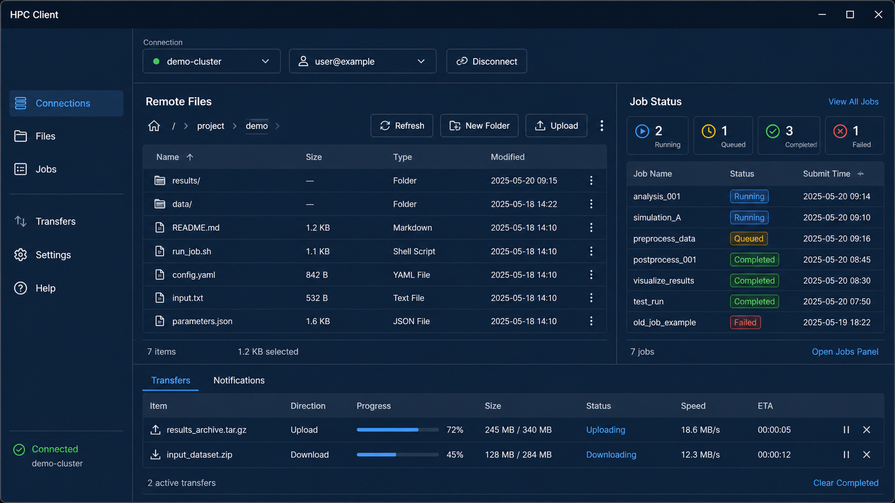

# HPC Client GUI

A **client-side GUI application** for **SSH + Slurm + optional X11 workflows** across Slurm-based HPC systems.

> ⚠️ This is an independent, client-side community project.
> It works with compatible SSH/Slurm HPC infrastructures.

---

A desktop client for remote access, files, scheduler jobs, and optional X11 on Slurm-compatible HPC clusters. Connect once, browse and transfer files, monitor jobs, and launch X11 tools only when needed.

**Latest release:** [v1.2.6](https://github.com/mskomek/hpc-client-gui/releases/tag/v1.2.6) includes Windows ZIP, Linux AppImage, and Linux `.deb` packages.

Quick start: **Download → Extract All → Run** `hpc-client-gui.exe`.



Python, PuTTY/plink, and VcXsrv are not required for normal SSH, file, or scheduler use. PuTTY/plink and VcXsrv are optional helpers only when X11 forwarding is enabled.

## Features

* SSH session management (client-side)
* Slurm job monitoring / basic job operations (via `squeue`, `sacct`, etc.)
* Remote file manager (copy / move / paste, drag & drop, resume, progress / cancel, undo-move)
* i18n: Turkish / English
* Centralized logging: `~/.truba_slurm_gui/app.log` (rotating)
* X11 runs **in the background**: `plink.exe -X` + `VcXsrv` (no dedicated X11 UI tab)

---

## Installation & Running

### Option A — Standalone portable package ✅ Recommended

In this mode, **Python is NOT required**.

1. Download the latest portable ZIP from [GitHub Releases](https://github.com/mskomek/hpc-client-gui/releases/tag/v1.2.6).
2. Extract All, then run `hpc-client-gui.exe`.
3. If you enable X11, approve the optional plink/VcXsrv downloads or install them yourself.


**External dependencies (NOT bundled in the EXE):**
- `plink.exe` (PuTTY)
- `VcXsrv` (required only for X11)
- Institutional firewall / antivirus policies (permissions may be required in some environments)

---

### Option B — From Source (Developer Mode)

#### Requirements

- Windows 10 / 11
- Python 3.10+ (recommended)
- (Optional) VcXsrv + plink.exe

#### Setup

```powershell
# In the project root directory
python -m venv .venv
.\.venv\Scripts\Activate.ps1

pip install -e .[test]
# or:
pip install -e .
```

#### Run

```powershell
python -m hpc_gui
```

---

### Option C — Linux

Linux releases target x86_64 and are published as AppImage and `.deb` packages.
Flatpak is optional because its runtime/SDK is substantially larger.

#### From source (any supported Linux distribution)

Requirements: Python 3.10+, a Qt runtime (PySide6 bundles it), and the platform
libraries Qt needs (`libegl1` on Ubuntu/Debian, equivalent on Fedora/openSUSE).

```bash
# In the project root directory
python -m venv .venv
. .venv/bin/activate
pip install -e .[test]
python -m hpc_gui
```

The CLI is available the same way: `python -m hpc_gui --help`.

#### Release packages

Download the AppImage or `.deb` from the release page and verify the matching
`.sha256` file. AppImage runs without installation; `.deb` is for Debian-based
systems.

Maintainers can build both platforms from Windows with Docker:

```powershell
.\scripts\build_release.ps1 -Version 1.2.6
# Reuse only existing Docker, Python, Flatpak, and AppImage caches:
.\scripts\build_release.ps1 -Version 1.2.6 -Offline
```

Build caches live under `.cache/release`; the release script creates one
combined `dist/releases/v<version>` directory and does not redownload existing
inputs unless they are missing.

#### Linux X11 note

X11 forwarding on Linux uses the **system OpenSSH client** (`ssh -X/-Y`); it does
not use the Windows plink/VcXsrv path. Confirm `ssh` is installed before relying
on X11 apps.

---

## Command-line Interface

`python -m hpc_gui` exposes a command-line interface (`hpc-client-gui` is its internal program name shown in help output). Top-level commands:

- `gui` - launch the desktop GUI
- `version` - print version and build information
- `profile` - manage saved connection profiles (`list`, `show`, `create`, `update`, `delete`, `test`)
- `doctor` - run local diagnostics (`environment`, `connection`, `smoke`)
- `files` - remote SFTP file operations (`ls`, `stat`, `checksum`, `mkdir`, `upload`, `download`, `cp`, `mv`, `rm`)
- `jobs` - scheduler job operations (`list`, `status`, `accounting`, `lssrv`, `submit`, `cancel`)

Shared global options exist (format, quiet, verbose, timeout, profile selection, host/port/user/key overrides, a stdin-based sensitive-value input flag, and strict host-key checking); `python -m hpc_gui --help` is authoritative.

- Full guides (drafted later in this wave):
  - Turkish: `src/hpc_gui/docs/CLI_GUIDE_tr.md`
  - English: `src/hpc_gui/docs/CLI_GUIDE_en.md`

---

## Documentation

- From within the application: click the **Help (❓)** icon in the top-left corner.
- As files:
  - Turkish: `src/hpc_gui/docs/HELP_tr.md`
  - English: `src/hpc_gui/docs/HELP_en.md`

---

## Security Notes

See [SECURITY.md](SECURITY.md) for supported versions and confidential vulnerability reporting.

- Passwords / tokens are **never written to history** and **never shown in the UI**.
- Secrets are **never logged** (commands may be logged, but credentials are not).
- X11 processes are cleaned up on application exit; orphan processes are handled defensively.

---

## ☕ Support HPC Client GUI

HPC Client GUI is developed and maintained as an independent community project.

If you find the project useful in your research or HPC workflow and would like
to support its continued development, voluntary donations are appreciated.

**Bitcoin (BTC):**

```text
bc1qvnrw2rn89rltx8ttj0hfyyte8lasgcsr7f3lxz
```


Donations are **completely optional** and do not unlock features, privileges,
priority support, or support guarantees.

**A donation does not grant commercial-use rights or constitute a commercial license.**

Commercial use still requires a separate commercial license. For additional
information and other ways to support the project, see [SUPPORT.md](SUPPORT.md).

---

## Licensing

Starting with v1.2.0, this project is licensed under the **PolyForm Noncommercial License 1.0.0** (see `LICENSE`).

- Free personal, academic, educational, public-research, and other permitted non-commercial use stays easy under the PolyForm Noncommercial 1.0.0 terms.
- **Commercial use requires a separate license.** Commercial embedding, incorporation, OEM/bundling, redistribution as a commercial product, and proprietary commercial derivatives are not covered by the PolyForm Noncommercial License. See [COMMERCIAL_LICENSE.md](COMMERCIAL_LICENSE.md) for details and contact information.

**Historical boundary:** releases before v1.2.0 were distributed under the MIT License. That MIT grant is **not revoked** for copies of those earlier releases that were already distributed; they remain MIT-licensed.

This is an independent, community project. It is not affiliated with TÜBİTAK, ANSYS, or any other organization. It is **client-side only**; it does **NOT** modify remote HPC infrastructure.

- Issues / PRs: via GitHub
